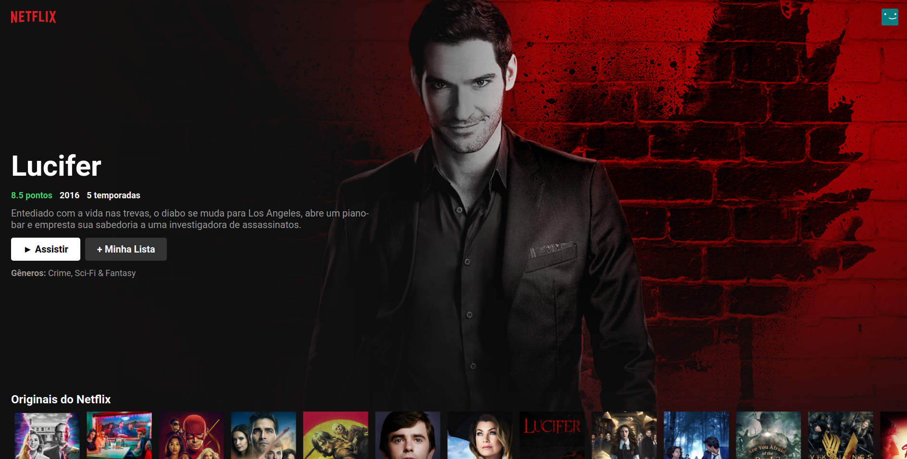
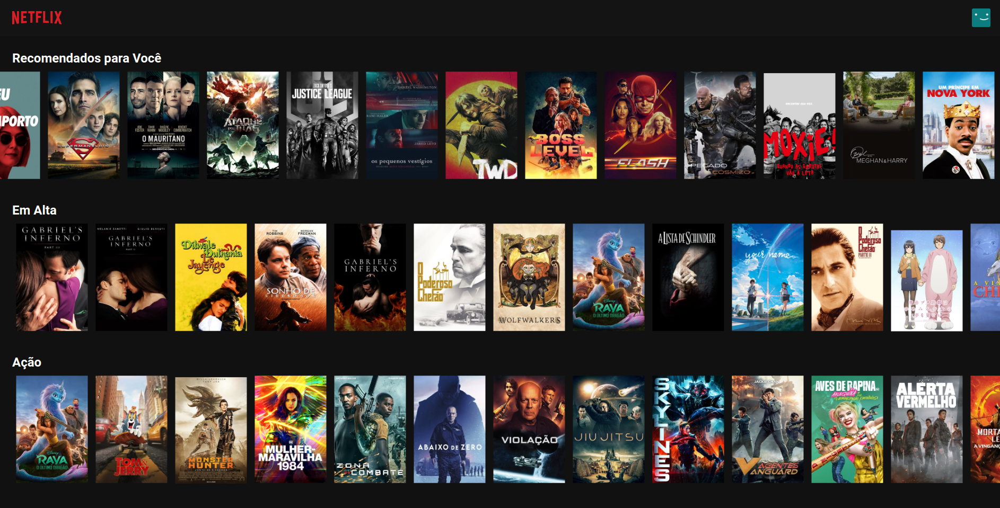
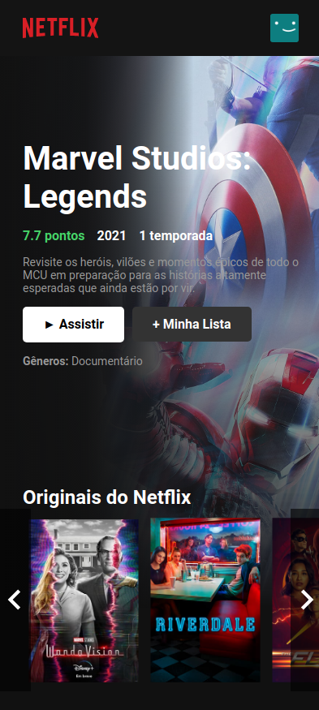

# Projeto Clone UI 

* Projeto de estudo de React
* Utilizando a API do <a href="https://www.themoviedb.org/">The Movie DB</a>
* Utilizando ícones do <a href = "https://www.material-ui.com">Material UI</a>

 Para funcionar deve adicionar um arquivo em "/src" chamado de ApiKey.js e adicionar o seguinte código:

 ```JavaScript   
export function RetornarKey(){
    return '' //adicionar a key
}

export function RetornarKeyBase(){
    return 'https://api.themoviedb.org/3'    //adicionar a url padrão da api
}
 ``` 

* Imagens

<p align="center">



</p>